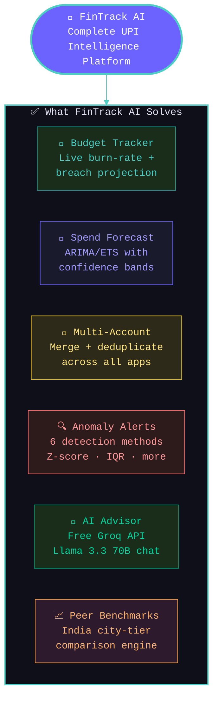
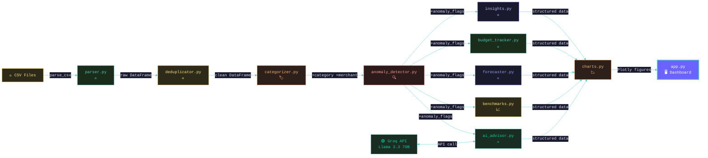
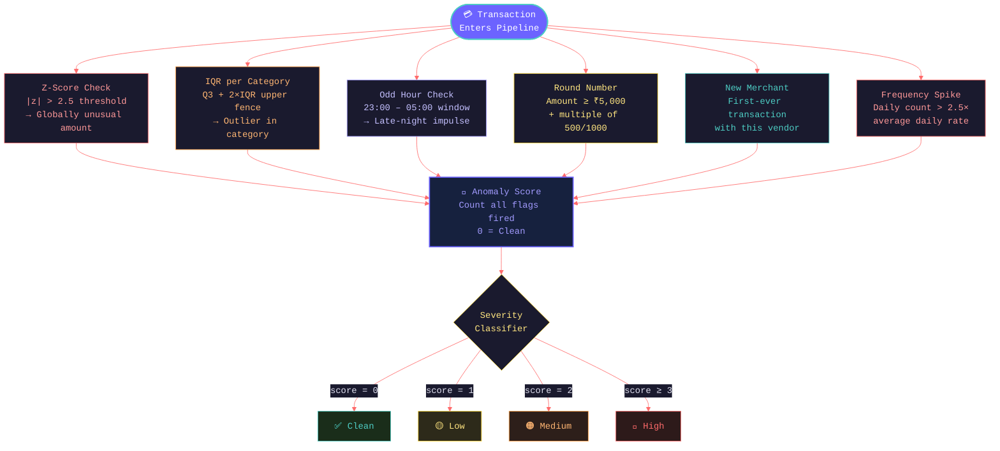
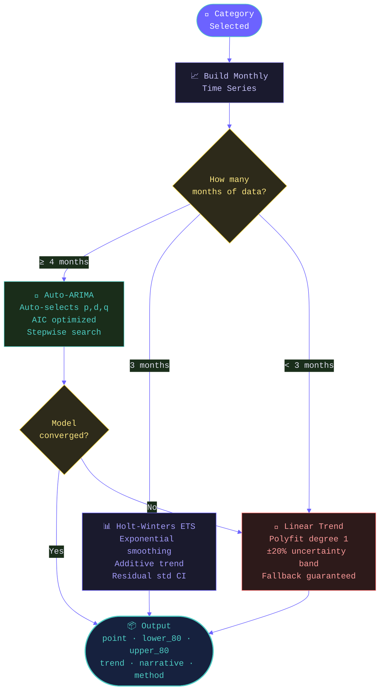

<div align="center">


<br/>


<br/><br/>

<a href="https://fintrack-ai-upi-spend-analyzer.streamlit.app/" target="_blank">
  
</a>
&nbsp;

&nbsp;

&nbsp;


<br/><br/>


&nbsp;

&nbsp;

&nbsp;


<br/><br/>


</div>

<br/>

## 📌 Quick Links

<div align="center">

| 🚀 [Live Demo](https://fintrack-ai-upi-spend-analyzer.streamlit.app/) | ❓ [Problem Statement](#-problem-statement) | 💡 [Solution](#-solution) |
|:---:|:---:|:---:|
| 🏗️ [Architecture](#-system-architecture) | ✨ [Features](#-features) | 🛠️ [Tech Stack](#%EF%B8%8F-tech-stack) |
| ⚡ [Quick Start](#-quick-start) | 📁 [File Structure](#-file-structure) | 🗺️ [Roadmap](#%EF%B8%8F-roadmap) |

</div>

<br/>


<br/>

## ❓ Problem Statement

<div align="center">

```
India has 500M+ UPI users conducting billions of transactions monthly.
Yet there is ZERO native tooling to understand where digital money goes.
```

</div>



```mermaid
%%{init: {'theme': 'base', 'themeVariables': {'primaryColor': '#1a1a2e', 'primaryTextColor': '#E0E0F0', 'primaryBorderColor': '#FF6B6B', 'lineColor': '#6C63FF', 'secondaryColor': '#16213e', 'tertiaryColor': '#0f0f1a', 'background': '#0f0f1a', 'mainBkg': '#1a1a2e', 'nodeBorder': '#6C63FF', 'clusterBkg': '#16213e', 'titleColor': '#E0E0F0', 'edgeLabelBackground': '#1a1a2e', 'fontFamily': 'monospace'}}}%%
flowchart LR
    subgraph PAIN ["🚨 The Pain Points"]
        direction TB
        A["🌑 Zero Visibility\nPeople tap UPI 30–50x/month\nbut can't track spending"]
        B["🔀 Multi-App Chaos\nGPay + PhonePe + Paytm\n= duplicate messy records"]
        C["📉 No Early Warnings\nOverspending discovered\nonly after month ends"]
        D["🧾 Subscription Leaks\n₹3,000–₹8,000/year\nsilently drained"]
        E["📊 No Benchmarks\nNo way to know if\nyour spend is normal"]
    end

    subgraph SCALE ["📈 Scale of Problem"]
        direction TB
        F["500M+\nUPI Users"]
        G["₹6L Crore\nMonthly UPI Volume"]
        H["< 5% Users\nTrack Spending"]
        I["₹0 Solutions\nBuilt for This Gap"]
    end

    PAIN --> SCALE

    style A fill:#2d1a1a,stroke:#FF6B6B,color:#FF9999
    style B fill:#2d2a1a,stroke:#FFD93D,color:#FFE580
    style C fill:#1a2d1a,stroke:#FF9F43,color:#FFB673
    style D fill:#1a1a2d,stroke:#A29BFE,color:#C4C0FF
    style E fill:#2d1a2d,stroke:#FF6B6B,color:#FF9999
    style F fill:#1a1a2e,stroke:#6C63FF,color:#6C63FF
    style G fill:#1a1a2e,stroke:#4ECDC4,color:#4ECDC4
    style H fill:#1a1a2e,stroke:#FF6B6B,color:#FF6B6B
    style I fill:#1a1a2e,stroke:#FFD93D,color:#FFD93D
    style PAIN fill:#0f0f1a,stroke:#FF6B6B,stroke-width:2px,color:#E0E0F0
    style SCALE fill:#0f0f1a,stroke:#6C63FF,stroke-width:2px,color:#E0E0F0
```

**The core problems are:**

| # | Problem | Impact |
|---|---------|--------|
| 🌑 | **Invisible spending** — UPI removes friction from paying, also from overspending | No moment of reflection before or after a transaction |
| 🔀 | **Multi-app fragmentation** — 2–3 UPI apps per person, impossible to reconcile | Duplicate entries inflate real spending figures |
| 📊 | **No behavioral intelligence** — Banks show raw lists, not patterns | Users never discover their own spending personality |
| 🧾 | **Subscription blindness** — Recurring charges accumulate silently | Most users can't name all active subscriptions |
| 📉 | **Reactive, not proactive** — No early-warning system exists | Budget awareness comes only after damage is done |
| 🏦 | **No benchmarking** — Can't compare your ₹8,000/month food spend to peers | No context to know if you're disciplined or excessive |

<br/>

## 💡 Solution



FinTrack AI is a **fully local, open-source Streamlit dashboard** that transforms raw UPI CSV exports into actionable financial intelligence. Works with every major UPI app, requires no backend server, sends no raw data anywhere, and gives you fintech-grade analysis — completely free.

<br/>

## 🏗️ System Architecture

```mermaid
%%{init: {'theme': 'base', 'themeVariables': {'primaryColor': '#1a1a2e', 'primaryTextColor': '#E0E0F0', 'primaryBorderColor': '#6C63FF', 'lineColor': '#6C63FF', 'secondaryColor': '#16213e', 'tertiaryColor': '#0f0f1a', 'background': '#0f0f1a', 'mainBkg': '#1a1a2e', 'clusterBkg': '#111128', 'titleColor': '#E0E0F0', 'edgeLabelBackground': '#1a1a2e', 'fontFamily': 'monospace'}}}%%
flowchart TD
    subgraph INPUT ["📤 Layer 1 — Data Ingestion"]
        direction LR
        GP["📱 Google Pay\nCSV Export"]
        PP["📲 PhonePe\nCSV Export"]
        PT["💳 Paytm\nCSV Export"]
        BH["🏦 BHIM / Bank\nCSV Export"]
        EX["➕ Extra Accounts\nMulti-upload sidebar"]
    end

    subgraph PIPELINE ["⚙️ Layer 2 — Processing Pipeline"]
        direction LR
        PA["📄 parser.py\n11 date formats\n4 UPI format maps\nAuto column detection"]
        DD["🔁 deduplicator.py\nFuzzy match RapidFuzz\nAmount ±₹1 · Date ±1 day\nScore threshold ≥72"]
        CA["🏷️ categorizer.py\nKeyword reverse index\n12 categories\n300+ keywords"]
        AN["🔍 anomaly_detector.py\nZ-Score · IQR · Odd Hour\nRound Num · New Merchant\nFrequency Spike"]
    end

    subgraph ANALYTICS ["🧠 Layer 3 — Analytics Engines"]
        direction LR
        IN["📊 insights.py\nMoM trend\nSubscriptions\nSavings · Velocity\nBehavioral nudges"]
        BT["🎯 budget_tracker.py\nBurn rate calc\nEOM projection\nBreach alerts\nStatus labeling"]
        FC["🔮 forecaster.py\nAuto-ARIMA\nHolt-Winters ETS\nLinear fallback\n80% confidence bands"]
        BM["📈 benchmarks.py\nTier 1/2/3 data\nLow/Mid/High bracket\nRatio vs peers\nSavings benchmark"]
        AI["🤖 ai_advisor.py\nGroq API\nLlama 3.3 70B\nMulti-turn chat\nContext injection"]
    end

    subgraph CHARTS ["📊 Layer 4 — Visualization"]
        direction LR
        CH["📉 charts.py\n8 Plotly builders\nDark theme\nCategory donut\nAnomaly scatter\nCalendar heatmap\nSavings gauge"]
    end

    subgraph DASHBOARD ["🖥️ Layer 5 — 10-Page Streamlit Dashboard  (app.py)"]
        direction LR
        P1["📊 Overview"]
        P2["🏷️ Categories"]
        P3["🔍 Anomalies"]
        P4["🧠 Insights"]
        P5["🎯 Budget"]
        P6["🔮 Forecast"]
        P7["🏦 Multi-Acct"]
        P8["🤖 AI Advisor"]
        P9["📈 Benchmarks"]
        P10["📋 Transactions"]
    end

    INPUT --> PIPELINE
    PA --> DD --> CA --> AN
    PIPELINE --> ANALYTICS
    ANALYTICS --> CHARTS
    CHARTS --> DASHBOARD

    style GP fill:#1a1a2e,stroke:#6C63FF,color:#A29BFE
    style PP fill:#1a1a2e,stroke:#6C63FF,color:#A29BFE
    style PT fill:#1a1a2e,stroke:#6C63FF,color:#A29BFE
    style BH fill:#1a1a2e,stroke:#6C63FF,color:#A29BFE
    style EX fill:#16213e,stroke:#6C63FF,color:#6C63FF,stroke-dasharray:5

    style PA fill:#1a2d1a,stroke:#4ECDC4,color:#4ECDC4
    style DD fill:#2d2a1a,stroke:#FFD93D,color:#FFE580
    style CA fill:#2d1f1a,stroke:#FF9F43,color:#FFB673
    style AN fill:#2d1a1a,stroke:#FF6B6B,color:#FF9999

    style IN fill:#1a1a2e,stroke:#A29BFE,color:#C4C0FF
    style BT fill:#1a2d1a,stroke:#4ECDC4,color:#4ECDC4
    style FC fill:#1a1a2d,stroke:#6C63FF,color:#A29BFE
    style BM fill:#2d2a1a,stroke:#FFD93D,color:#FFE580
    style AI fill:#1a2d22,stroke:#00A67E,color:#00D4A0

    style CH fill:#16213e,stroke:#FF9F43,color:#FFB673

    style P1 fill:#1a1a2e,stroke:#6C63FF,color:#A29BFE
    style P2 fill:#1a2d1a,stroke:#4ECDC4,color:#4ECDC4
    style P3 fill:#2d1a1a,stroke:#FF6B6B,color:#FF9999
    style P4 fill:#2d1f1a,stroke:#FF9F43,color:#FFB673
    style P5 fill:#1a2d22,stroke:#00A67E,color:#00D4A0
    style P6 fill:#1a1a2d,stroke:#A29BFE,color:#C4C0FF
    style P7 fill:#2d2a1a,stroke:#FFD93D,color:#FFE580
    style P8 fill:#1a2d22,stroke:#00A67E,color:#00D4A0
    style P9 fill:#2d1a2d,stroke:#FF6B6B,color:#FF9999
    style P10 fill:#1a1a2e,stroke:#6C63FF,color:#A29BFE

    style INPUT fill:#0a0a18,stroke:#6C63FF,stroke-width:2px,color:#E0E0F0
    style PIPELINE fill:#0a0a18,stroke:#4ECDC4,stroke-width:2px,color:#E0E0F0
    style ANALYTICS fill:#0a0a18,stroke:#FF9F43,stroke-width:2px,color:#E0E0F0
    style CHARTS fill:#0a0a18,stroke:#FF6B6B,stroke-width:2px,color:#E0E0F0
    style DASHBOARD fill:#0a0a18,stroke:#A29BFE,stroke-width:2px,color:#E0E0F0
```



<br/>

### 🔄 Module Interaction Map



<br/>

### 🔍 Anomaly Detection Logic



<br/>

### 🔮 Forecasting Model Selection Logic



<br/>

## ✨ Features

<table>
<tr>
<td width="50%" valign="top">

### 📊 Core Analytics
- Auto-categorization into **12 spending categories** via keyword reverse index
- Merchant extraction with **30+ brand canonical name** mappings
- **Monthly trend** with MoM change line overlay
- **Day-of-week heatmap** and weekend vs weekday split
- **Spend calendar** — GitHub-style contribution heatmap

### 🎯 Budget Tracker
- Set monthly ₹ limits per category via inline editor
- Live **progress bars** with colour-coded status badges
- **Burn-rate projection** — *"At ₹450/day you'll exceed Food budget by ₹800 in 12 days"*
- Budget status persists in `st.session_state` across navigation
- Grouped bar: Spent vs Projected vs Budget limit

### 🏦 Multi-Account Deduplication
- Upload CSVs from **GPay + PhonePe + bank** simultaneously
- Detection: amount **±₹1**, date **±1 day**, description fuzzy score **≥72/100**
- Keeps richer description, excludes the duplicate
- Full dedup report: count removed, ₹ de-noised, source breakdown

</td>
<td width="50%" valign="top">

### 🔍 Anomaly Detection *(6 methods)*
- **Z-Score** — globally unusual transaction amounts
- **IQR per category** — outliers within each spend bucket
- **Odd-hour** — transactions between 11 PM and 5 AM
- **Round number** — suspicious large round amounts
- **New merchant** — first-ever transaction with vendor
- **Frequency spike** — abnormally high-activity days

### 🔮 Spend Forecasting
- Auto-selects best model: **ARIMA → ETS → Linear**
- **80% confidence intervals** rendered as error bars
- Per-category sparklines: history + forecast diamond
- Total forecast narrative in plain English

### 🤖 AI Financial Advisor *(Free)*
- **Groq API + Llama 3.3 70B** — no credit card needed
- Injects statistical summary as context, not raw transactions
- Multi-turn conversation with full history
- 8 one-click starter question chips
- Auto monthly financial health summary

</td>
</tr>
</table>

<br/>

## 🛠️ Tech Stack

<div align="center">

| Layer | Technology | Purpose |
|-------|-----------|---------|
| **UI Framework** |  | 10-page interactive dashboard |
| **Data Processing** |   | ETL, aggregation, time-series |
| **Visualization** |  | All interactive charts |
| **ML / Statistics** |   | Z-score, IQR anomaly detection |
| **Forecasting** | `statsmodels` + `pmdarima` | Auto-ARIMA · Holt-Winters ETS |
| **Fuzzy Matching** | `rapidfuzz` | Transaction deduplication |
| **AI / LLM** |  | Free AI financial advisor |
| **Language** |  | Core runtime |
| **Deployment** |  | Public hosting |

</div>

<br/>

## ⚡ Quick Start

```bash
# 1. Clone the repository
git clone https://github.com/YOUR_USERNAME/fintrack-ai-upi-spend-analyzer.git
cd fintrack-ai-upi-spend-analyzer

# 2. Create and activate virtual environment
python -m venv venv
source venv/bin/activate        # macOS/Linux
venv\Scripts\activate           # Windows

# 3. Install dependencies
pip install -r requirements.txt

# 4. Add your free Groq API key (only needed for AI Advisor page)
#    Get your free key at https://console.groq.com — no credit card needed
mkdir -p .streamlit
echo 'GROQ_API_KEY = "gsk_your_key_here"' > .streamlit/secrets.toml

# 5. Launch the app
streamlit run app.py
```

Open **http://localhost:8501** — tick **"Use sample data"** in the sidebar for an instant demo without uploading anything.

<br/>

## 📁 File Structure

```
fintrack-ai-upi-spend-analyzer/
│
├── 📄 app.py                        # Main Streamlit dashboard — 10 pages
├── 📋 requirements.txt              # Dependencies (flexible version bounds)
├── 📖 README.md                     # This file
├── 🐍 runtime.txt                   # python-3.12 (Streamlit Cloud pin)
│
├── 🔐 .streamlit/
│   └── secrets.toml                 # GROQ_API_KEY (gitignored)
│
├── ⚙️ config/
│   └── categories.json              # 12 categories · 300+ keywords · icons · hex colors
│
├── 🗃️ data/
│   └── sample_transactions.csv      # 90 demo transactions across 3 months
│
└── 🐍 modules/
    ├── __init__.py
    ├── parser.py                    # CSV ingestion, 11 date formats, 4 UPI formats
    ├── categorizer.py               # Keyword reverse-index categorizer
    ├── anomaly_detector.py          # 6-method anomaly detection engine
    ├── insights.py                  # Behavioral patterns, nudges, subscriptions
    ├── charts.py                    # 8 Plotly chart builders (dark theme)
    ├── budget_tracker.py            # Monthly goals + burn-rate projection
    ├── forecaster.py                # Auto-ARIMA / Holt-Winters ETS / Linear
    ├── deduplicator.py              # Fuzzy multi-account deduplication
    ├── ai_advisor.py                # Groq chat advisor (Llama 3.3 70B)
    └── benchmarks.py               # India city-tier peer comparison engine
```

<br/>

## 📤 Supported CSV Formats

<div align="center">

| UPI App | How to Export |
|---------|--------------|
| **Google Pay** | GPay app → Profile → Statement → Download CSV |
| **PhonePe** | PhonePe → History → Download Statement → Email CSV |
| **Paytm** | Paytm → Passbook → Download Statement |
| **BHIM** | Transaction History → Export |
| **Any Bank** | Any CSV with `Date`, `Description`, `Amount` columns |

**Minimum required columns:** `Date` · `Description` · `Amount`

</div>

<br/>

## 🔒 Privacy First

```
Your Data Never Leaves Your Machine
━━━━━━━━━━━━━━━━━━━━━━━━━━━━━━━━━━━━━━━━━━━━━━━

  CSV Upload ──→ Local Processing ──→ Local Dashboard
                        │
                        ▼
              ONLY the 🤖 AI Advisor page
              sends a STATISTICAL SUMMARY
              (category totals, averages, counts)
              to Groq API

              ❌ Raw transaction descriptions
              ❌ Merchant names
              ❌ Exact amounts
              → are NEVER sent anywhere

━━━━━━━━━━━━━━━━━━━━━━━━━━━━━━━━━━━━━━━━━━━━━━━
```

<br/>

## ⚙️ Configuration & Tuning

**Add or modify spending categories** in `config/categories.json`:
```json
"My Category": {
  "keywords": ["merchant name", "keyword", "upi@handle"],
  "icon": "🏷️",
  "color": "#FF6B6B"
}
```

**Tune anomaly sensitivity** in `modules/anomaly_detector.py`:
```python
Z_SCORE_THRESHOLD     = 2.5   # Lower = more anomalies flagged
IQR_MULTIPLIER        = 2.0   # Lower = stricter per-category outlier detection
LARGE_ROUND_THRESHOLD = 5000  # Minimum ₹ for round-number flag to trigger
```

**Tune deduplication strictness** in `modules/deduplicator.py`:
```python
FUZZY_THRESHOLD  = 72   # 0–100, lower catches more (riskier) duplicates
DATE_WINDOW_DAYS = 1    # ±N days window for same transaction
AMOUNT_TOLERANCE = 1.0  # ₹ difference allowed for amount match
```

<br/>

## 🗺️ Roadmap

- [ ] 📸 WhatsApp/screenshot OCR parser using Tesseract
- [ ] 📄 PDF tax summary — 80C investment auto-detection
- [ ] 🔁 UPI ID network graph (NetworkX + Pyvis)
- [ ] 📱 Progressive Web App (PWA) mobile mode
- [ ] 🔔 Budget breach WhatsApp / email alerts
- [ ] 🏦 Live bank sync via Setu / Finbox AA APIs
- [ ] 🌍 Multi-currency support for NRI users

<br/>

## 🤝 Contributing

Contributions are very welcome!

1. Fork the repository
2. Create your feature branch — `git checkout -b feature/AmazingFeature`
3. Commit your changes — `git commit -m 'Add AmazingFeature'`
4. Push to the branch — `git push origin feature/AmazingFeature`
5. Open a Pull Request

<br/>

---

<div align="center">


<br/>

**Built with ❤️ for India's 500M+ UPI users**

<br/>

[](https://fintrack-ai-upi-spend-analyzer.streamlit.app/)

<br/>

*If this project helped you, please give it a ⭐ — it means a lot!*

</div>
